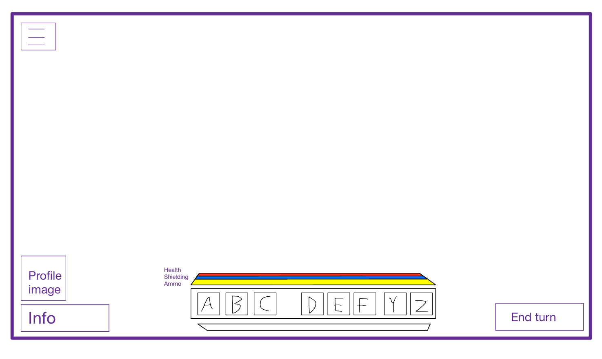

# <u>Nicery</u>
Nicery is a turn-based tactical strategy game.

##### <u>Table of Content</u>

[Core Mechanics](#core)
- [Tiles](#tile)
- [Unit Abilities](#abilities)
- [UI](#ui)

[Gameplay Mechanics](#gameplay)
- [Hacking](#hacking)
## <u>Core Mechanics</u> 
#### Tile Grid
The grid on which the game is set is a square grid with each square referred to as a tile. 
### Tile 
A tile contains multiple layers. A preceding layer is required to allow other layers. For instance, if the terrain layer does not support an environment layer, then naturally a unit layer is not supported as well.

- Terrain layer
- Environment/building layer
- Unit layer
- Object layer

#### Terrain
The terrain layer determines the base attributes of a tile. This can include whether a tile can be moved on, can be built on, etc.

| Terrain Stats | Value |     | Info                                                   |
| ------------- | ----- | --- | ------------------------------------------------------ |
| Buildable     | Bool  |     | Whether the tile possesses a environment layer or not. |
| Height        | Int   |     | From 1 to 5, how high the tile is.                     |
#### Environment
The environment layer determines various modifiers for the subsequent unit layer.

| Environment Stats | Value |     | Info                                                |
| ----------------- | ----- | --- | --------------------------------------------------- |
| Walkable          | Bool  |     | Whether or not the tile possesses a unit layer.     |
| Liquid            | Bool  |     | Whether or not the tile is swimmable.               |
|                   |       |     |                                                     |
| Resistance        | Int   |     | Flat amount of resistance added to the unit on top. |
|                   |       |     |                                                     |
#### Unit Layer
The unit layer determines the unit on a tile. Moving units such as an infantry are considered units, as well as vehicles, stationary artillery, or some buildings.

| Unit Stats  | Value  |     |     | Info                                                                            |
| ----------- | ------ | --- | --- | ------------------------------------------------------------------------------- |
| Movement    | Int    |     |     | How many instances of movement per turn a unit has. If 0, then it has none.     |
| Attack      | Int    |     |     | How many instances of attack per turn a unit has. If 0, then it has none.       |
| Interaction | Int    |     |     | How many instances of interaction per turn a unit has. If 0, then it has none.  |
| Team        | String |     |     | To which faction the unit has allegiance to?                                    |
| Hackable    | Bool   |     |     | Whether or not the unit can be hacked.                                          |
|             |        |     |     |                                                                                 |
| Health      | Int    |     |     | Health of the unit.                                                             |
| Resistance  | Float  |     |     | Resistance of the unit. Counted as a flat percentage (1 armor = 1% resistance). |
| Shielding   | Int    |     |     | Bonus health.                                                                   |
| Speed       | Int    |     |     | How many tiles a unit can traverse per turn.                                    |
#### Object Layer
An object on a tile is interactable by a unit. For instance, this could be spare ammunition on the ground, or a terminal. Multiple objects can be on the same tile.

| Object Stats | Value |     | Info                                                   |
| ------------ | ----- | --- | ------------------------------------------------------ |
| Persistance  | Bool  |     | Does the object dissipate after all uses are expended. |
| Uses         | Int   |     | How many uses an object has.                           |
|              |       |     |                                                        |
### Unit Abilities 
Units can have several abilities used by either their attack instance or interaction instance. 
### UI 

<a href="./img/ui-v1.png">Link to image.</a>

## <u>Gameplay Mechanics</u> 
### Hacking 
Hacking is an ability that can be used by some units.
#### Hacking Units
Hacking an enemy unit can have different results:
- Paralysis
- Debuff
- Team conversion
- Destruction

#### Hacking Nodes
Instead of units, certain objects and abilities can allow the hacking of nodes representing a network system.

Each node is represented by an object on the map, such as a computer or a server.